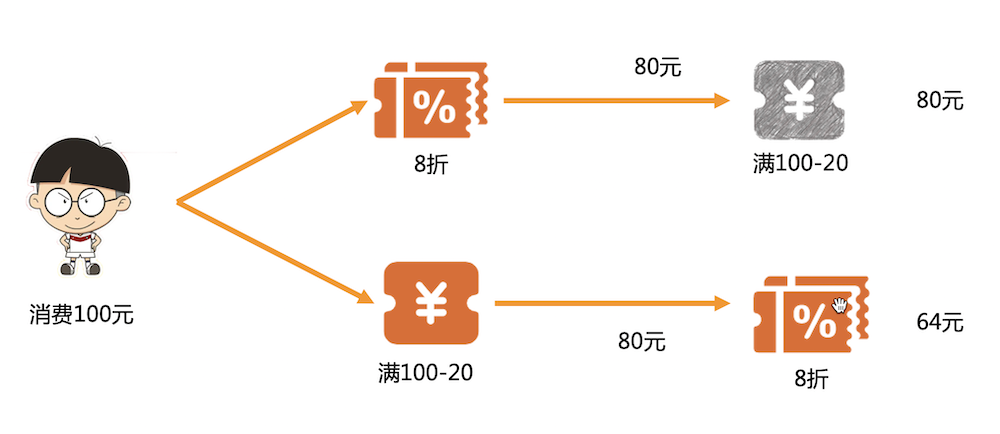

### 背景介绍
在电商领域中，运营策略往往能直接影响到平台的收益，最常见的运营策略之一就是赠送优惠券了。在用户选完商品后，电商系统需要对用户所拥有且能使用的优惠券来计算出当前结算的最优惠金额，而有些类型的优惠券又是可叠加计算的，也就是说优惠券的计算顺序不一样，最终的计算出的实付金额也就不一样。



假如某用户有7种不同类型的优惠券（下文简称权益），那么就需要计算7! * 7也就是35280次。
这个计算量是非常庞大的。因此，本系统实现了很多新颖的设计来求出用户优惠券叠加计算的最优解并且保证了接口的响应时间。


### 项目设计
#### 核心计算类 Permutation&lt;T extends GoodsItem&gt;

`Permutation`是`equity-calculator`的核心部分。它是一个抽象类，在`Permutation`中设计了以下优化策略来保证性能：
- 预存排列组合
这么设计的原因是在业务场景中需要频繁的计算排列，对于某个长度的序列，其排列结果是固定的。在Permutation类中的PERMUTATIONS属性存放了7以内的排列数结果集，这里使用了Byte来存储，因此占用的内存空间非常小。
```Java
private final static Map<Integer,Collection<List<Byte>>> PERMUTATIONS = Maps.newHashMap();
```
这个动作在类加载即完成，如果对7不满意，可以调整SUPPORTEDSIZE的大小，7是在实现中兼顾业务和性能最佳的参数，大家可以根据自己的需要来调整。

```Java
public final static int SUPPORTEDSIZE = 7;

static{
      //前置计算 1-SUPPORTEDSIZE 之间所有排列组合
    for(byte i=1;i<=SUPPORTEDSIZE;i++){
       PERMUTATIONS.put((int)i,Collections2.permutations(IntStream.range(0,i).boxed().map(x->(byte)x.intValue()).collect(Collectors.toList())));
      }
  }

```

- $A_n^3$ 级别缓存

相对于传统的`Key-Value`结构，求解 $A_n^n$ 问题的缓存需要特殊设计，对一个优惠集合而言 $A_n^3$ 意味着缓存 n x (n-1) x (n-2) 条数据，默认n为7则需要缓存210条数据，兼顾内存大小和缓存带来的性能收益， $A_n^3$ 是最为合适的。

`Permutation`的成员变量`cache`来实现高性能缓存。

```Java
private final Map<Integer, CalcState<T>> cache = Maps.newHashMap();
```
`cache`的键是采用`Integer`类型的，通常`String`会更常用，然而在万次计算的场景下，`String`的拼接已经成了瓶颈。
为了实现高性能的键，`Permutation`通过位移对`Byte`数组的前3位进行扰动，确保键的唯一性和性能。

```Java
private static Integer calcKey(List<Byte> a){
       return  a.size()>=3?(a.get(0) << 6)+ (a.get(1) << 3) + a.get(2):0;
}
```

`Permutation`提供了保存点来实现 $A_n^3$ 级别缓存，`CalcState` 记录了计算到第3步的状态，包括当前订单优惠金额和计算过程、已享用优惠的商品等，这些属性的保存和回放`Permutation`已经帮你做好了，`Permutation`额外提供了抽象的保存和回放方法来满足你的个性化诉求。

```Java
   /**
     * 业务将状态记录到保存点
     * @param state 保存点对象
     */
    protected abstract void makeSnapshot(DiscountContext<T> context, CalcState<T> state);

    /**
     * 业务返回保存点状态
     * @param state 保存点对象
     */
    protected abstract void backToSnapshot(DiscountContext<T> context, CalcState<T> state);
```

优惠计算是有优先级的，必须保证属性`calculateGroup`值小的在前面运算，当`backToSnapshot`发生时，需要额外判断缓存中最后一个优惠和当前准备计算优惠之间的关系，若不满足则直接跳出。`checkIfWakeUpJump`方法将在缓存被使用后立刻判断是否需要继续下去。

#### 上下文类 DiscountContext&lt;T extends GoodsItem&gt;
`DiscountContext`是权益叠加计算过程中被不断传递和修改的上下文，也是`Permutation`的成员变量，`DiscountContext`同样包含很多优化策略：

- CalcStage数组

在变更最频繁也是最重要的计算步骤对象`CalcStage`使用数组存储，该数组随着上下文创建而创建，在`Permutation`中使用

```Java
Arrays.fill(arr,null);
```

将该数组清空并让它投入下一次计算，这样一次全排列过程中，数组只会被创建一次，避免了频繁创建数组带来的性能损耗。

- 预计算

`DiscountContext`的初始化方法是静态的`create`方法，该方法将商品和权益进行绑定，同时执行一些用户自定义的逻辑，这个过程简称为`预计算`，预计算的结果会被保存在`DiscountContext`的`preCompute`属性，可以在后续的计算中直接取用，一劳永逸，避免了在后续的高速迭代中做相同的事情，比如商品分组、求和等等。

#### 预计算 PreCompute&lt;T extends GoodsItem&gt;

预计算提供了接口，要使用预计算首先需要实现PreCompute接口

```Java
public interface PreCompute<T extends GoodsItem> {
    /**
     * 判断符合条件的活动类型，符合才会执行preComputeItems
     */
    Set<String> matchTypes();

    /**
     * 对商品做一些复杂集合操作
     * @param items 当前参与优惠的商品
     * @param discount 当前优惠
     * @param preCompute 存储计算的结果
     */
     void preComputeItems(List<T> items, DiscountWrapper discount, Map<String,Object> preCompute);
}
```

此外需要在资源目录下建立`calculator-core.properties`文件，配置内容如下

```Java
precompute.path=你要扫描的包
```
`PreComputeHolder`将处理所有的`PreCompute`实现类，只有`matchTypes`匹配的情况下`preComputeItems`方法才会被执行。

```Java
public class PreComputeHolder {
    public static Set<PreCompute> COMPUTES= Sets.newHashSet();
    private final static String PATH = "precompute.path";

    static{
        Properties properties = new Properties();
        try {
              properties = PropertiesLoaderUtils.loadProperties(new FileSystemResource(Objects.requireNonNull(PreComputeHolder.class.getClassLoader().getResource("calculator-core.properties")).getPath()));
        } catch (Exception ignore) {
        }
        String path = properties.getProperty(PATH);
        if(StringUtils.isNotBlank(path)){
            Reflections reflections = new Reflections(path);
            Set<Class<? extends PreCompute>> subTypes = reflections.getSubTypesOf(PreCompute.class);
            for(Class<? extends PreCompute> clazz:subTypes){
                try {
                    COMPUTES.add(clazz.newInstance());
                } catch (Exception ignore) {
                }
            }
        }
    }
}
```

#### 计算器 Calculator

`Calculator`是单个优惠的计算接口，它有`calcWarp`一个方法，负责具体的优惠计算，但`calcWarp`需要承担一些内部的事情，因此提供了抽象类`AbstractCalculator`实现了`calcWarp`，并最终暴露了一个更简单的`calc`方法给使用者。

`AbstractCalculator`的内容如下，`calcWarp`方法负责创建`CalcStage`，维护`CalcStage`数组等内部工作，这对使用者来说是透明的，使用者实现`calc`就好。

```Java
public abstract class AbstractCalculator<T extends GoodsItem> implements Calculator<T> {
    public long calcWarp(DiscountContext<T> context, DiscountWrapper discountWrapper, Map<Long, T> records, byte idx, int i) {
        CalcStage stage = new CalcStage();
        CalcResult cr = context.getCalcResult();
        long price= cr.getCurPrice();
        stage.setBeforeCalcPrice(price);
        price = calc(context, discountWrapper,records, price, stage);
        if(price<0){
            return price;
        }
        stage.setAfterCalcPrice(price);
        stage.setIndex(idx);
        stage.setStageType(discountWrapper.getType());
        cr.setCurPrice(price);
        if(stage.getBeforeCalcPrice()>stage.getAfterCalcPrice()) {
            cr.getCurStages()[i] = stage;
        }
        return price;
    }

    /**
     * 返回该优惠下的最终要支付的金额,若不符合则返回 prevStagePrice
     * @param context 上下文
     * @param discountWrapper 优惠信息
     * @param records 记录享受过优惠的单品，key是calculateId，这里只提供容器，添加和判断规则由使用者自行决定
     * @param prevStagePrice 上一步计算的订单的价格
     * @param curStage 当前stage
     * @return
     */
    public abstract  long calc(DiscountContext<T> context, DiscountWrapper discountWrapper, Map<Long,T> records, long prevStagePrice, CalcStage curStage);

}

```
最终用户继承`AbstractCalculator`，需要在`Component`注解中指定一个值，而`CalculatorRouter`将通过这个值来路由到具体的权益计算器。这个值和`DiscountWrapper`中的`type`属性是对应的。

```Java
@Component("discount")
public class DiscountCalc extends AbstractCalculator<GoodsItem> {
......
}
```
